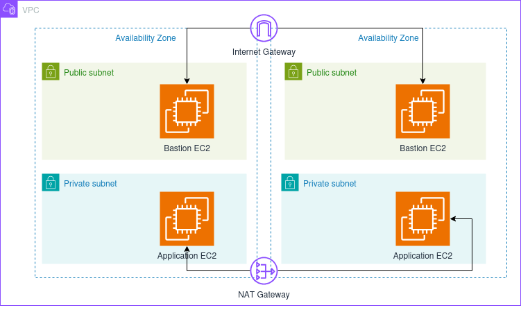
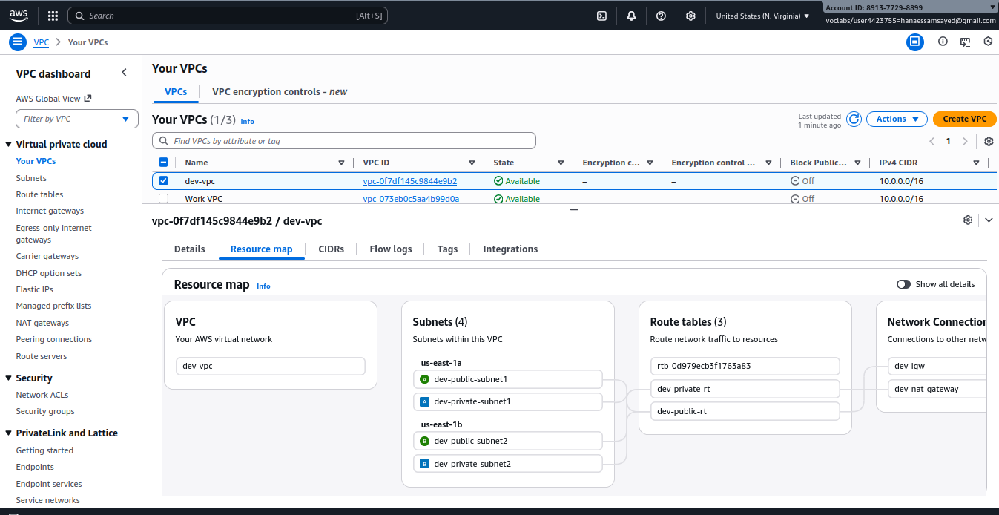

# AWS Infrastructure with Terraform

## Overview

This project implements a secure, scalable AWS infrastructure using Terraform Infrastructure as Code (IaC). The architecture includes a Virtual Private Cloud (VPC) with public and private subnets, EC2 instances for bastion host and application servers, NAT Gateway for secure outbound internet access, and remote state management using AWS S3.

## Architecture Diagram



## Infrastructure Components

### Networking Layer

#### VPC Configuration
- **VPC CIDR Block**: 10.0.0.0/16
- **Public Subnets**: 
  - 10.0.1.0/24 (us-east-1a)
  - 10.0.3.0/24 (us-east-1b)
- **Private Subnets**: 
  - 10.0.2.0/24 (us-east-1a)
  - 10.0.4.0/24 (us-east-1b)
- **Multi-AZ Deployment**: Resources deployed across two availability zones for high availability

#### Internet Connectivity
- **Internet Gateway**: Provides internet access for resources in public subnet
- **NAT Gateway**: Enables outbound internet connectivity for private subnet resources
- **Elastic IP**: Static public IP address attached to NAT Gateway

#### Route Tables
- **Public Route Table**: Routes traffic from public subnet to Internet Gateway (0.0.0.0/0)
- **Private Route Table**: Routes traffic from private subnet to NAT Gateway (0.0.0.0/0)

### Security Groups

#### Bastion Security Group (Public)
- **Ingress**: SSH (port 22) from 0.0.0.0/0
- **Egress**: All traffic allowed
- **Purpose**: Allows SSH access from internet to bastion host

#### Application Security Group (Private)
- **Ingress**: 
  - SSH (port 22) from Bastion Security Group only
  - Application port (3000) from VPC CIDR only
- **Egress**: All traffic allowed
- **Purpose**: Restricts access to application servers, only allowing SSH from bastion and application traffic from within VPC

### Compute Resources

#### Bastion Host
- **Instance Type**: t2.micro
- **AMI**: Amazon Linux 2 (ami-0fa3fe0fa7920f68e)
- **Subnet**: Public Subnet
- **Public IP**: Enabled
- **Purpose**: Jump server for SSH access to private instances
- **Key Pair**: Automatically generated RSA 4096-bit key

#### Application Server
- **Instance Type**: t2.micro
- **AMI**: Amazon Linux 2 (ami-0fa3fe0fa7920f68e)
- **Subnet**: Private Subnet
- **Public IP**: Disabled
- **Purpose**: Hosts Node.js application
- **Installed Software**: Node.js 18.x, gcc-c++, make
- **Key Pair**: Same as bastion host

### State Management

#### Remote State Backend
- **Backend**: AWS S3
- **Bucket**: terraform-state-bucket-example123
- **Encryption**: Enabled
- **Region**: us-east-1
- **State File**: terraform.tfstate

## Project Structure

```
iac_terraform_aws/
├── main.tf                      # Root module configuration
├── variables.tf                 # Root variable definitions
├── outputs.tf                   # Root outputs
├── providers.tf                 # AWS provider configuration
├── versions.tf                  # Terraform version constraints
├── backend.tf                   # S3 backend configuration
├── modules/
│   ├── network/
│   │   ├── main.tf             # Network orchestration
│   │   ├── variables.tf        # Network module variables
│   │   ├── outputs.tf          # Network module outputs
│   │   ├── vpc/                # VPC submodule
│   │   ├── subnet/             # Subnet submodule (creates public and private)
│   │   ├── igw/                # Internet Gateway submodule
│   │   ├── nat/                # NAT Gateway submodule
│   │   ├── route_table/        # Route table submodule
│   │   └── route_table_assoc/  # Route table association submodule
│   └── compute/
│       ├── main.tf             # Compute orchestration
│       ├── variables.tf        # Compute module variables
│       ├── outputs.tf          # Compute module outputs
│       ├── ec2/                # EC2 instance submodule
│       ├── sg/                 # Security group submodule
│       └── key_pair/           # SSH key pair submodule
├── env/
│   ├── dev.tfvars              # Development environment variables
│   ├── prod.tfvars             # Production environment variables
│   └── example.tfvars          # Template for environment variables
└── README.md                   # Project documentation
```

## Prerequisites

- Terraform >= 1.0
- AWS CLI configured with appropriate credentials
- AWS account with necessary permissions
- SSH client for accessing bastion host

## Environment Variables

Each environment requires the following variables (see `env/example.tfvars`):

```hcl
region               = "us-east-1"
vpc_cidr             = "10.0.0.0/16"
env_name             = "dev"
public_subnet1_cidr  = "10.0.1.0/24"
public_subnet2_cidr  = "10.0.3.0/24"
private_subnet1_cidr = "10.0.2.0/24"
private_subnet2_cidr = "10.0.4.0/24"
ami                  = "ami-0fa3fe0fa7920f68e"
instance_type        = "t2.micro"
```

## Deployment Instructions

### 1. Initialize Terraform

```bash
terraform init
```


### 2. Validate Configuration

```bash
terraform validate
```

### 3. Plan Infrastructure Changes

```bash
terraform plan -var-file=env/dev.tfvars
```

### 4. Apply Configuration

```bash
terraform apply -var-file=env/dev.tfvars
```


### 5. Retrieve Outputs

```bash
terraform output
```

Expected outputs:
- `bastion_public_ip`: Public IP address of bastion host
- `app_private_ip`: Private IP address of application server
- `vpc_id`: VPC identifier
- `nat_gateway_ip`: Elastic IP of NAT Gateway
- `bastion_ssh_key_path`: Local path to SSH private key
- `ssh_connection_command`: Ready-to-use command to connect to bastion

Example output:
```
app_private_ip         = "10.0.2.69"
bastion_public_ip      = "54.234.109.13"
bastion_ssh_key_path   = "modules/compute/key_pair/dev_bastion_key.pem"
nat_gateway_ip         = "44.205.27.168"
ssh_connection_command = "ssh -i modules/compute/key_pair/dev_bastion_key.pem ec2-user@54.234.109.13"
vpc_id                 = "vpc-0c47d8f063e107055"
```


## Accessing the Infrastructure

### Connect to Bastion Host

Use the SSH connection command from terraform output:

```bash
ssh -i modules/compute/key_pair/dev_bastion_key.pem ec2-user@<bastion_public_ip>
```

Or copy the exact command from terraform output:

```bash
terraform output -raw ssh_connection_command | bash
```

### Connect to Application Server (via Bastion)

From the bastion host:

```bash
ssh ec2-user@<app_private_ip>
```

Example:
```bash
[ec2-user@ip-10-0-1-211 ~]$ ssh ec2-user@10.0.2.69
```

## AWS Console Verification

### VPC Dashboard




## Security Considerations

1. **Principle of Least Privilege**: Application servers are isolated in private subnet with no direct internet access
2. **Bastion Host Pattern**: Single point of entry for SSH access to private resources
3. **Security Group Restrictions**: Application security group only accepts SSH from bastion security group
4. **State File Encryption**: Terraform state is encrypted at rest in S3
5. **Key Management**: SSH private keys stored locally (excluded from git via .gitignore)
6. **NAT Gateway**: Provides secure outbound internet access for updates and patches without exposing servers

## Network Flow

### Inbound Traffic
```
Internet → Internet Gateway → Public Subnet → Bastion Host
Bastion Host → Private Subnet → Application Server
```

### Outbound Traffic (from Private Subnet)
```
Application Server → NAT Gateway (in Public Subnet) → Internet Gateway → Internet
```

## Cost Estimation

Monthly cost breakdown (approximate):
- EC2 Instances (2 × t2.micro): $16.00
- NAT Gateway: $32.40 + data transfer costs
- Elastic IP (associated): $0.00
- Elastic IP (unassociated): $3.60/month
- S3 Storage: < $1.00

**Total Estimated Monthly Cost**: ~$50-55 USD

## Terraform Commands Reference

| Command | Description |
|---------|-------------|
| `terraform init` | Initialize Terraform working directory |
| `terraform validate` | Validate Terraform configuration |
| `terraform plan` | Preview infrastructure changes |
| `terraform apply` | Create or update infrastructure |
| `terraform destroy` | Destroy all managed infrastructure |
| `terraform output` | Display output values |
| `terraform state list` | List resources in state |
| `terraform fmt` | Format Terraform configuration files |

## Cleanup

To destroy all resources:

```bash
terraform destroy -var-file=env/dev.tfvars
```

**Warning**: This will permanently delete all resources managed by this Terraform configuration.

## Troubleshooting

### Issue: Cannot connect to bastion host
- Verify security group allows SSH from your IP
- Ensure correct SSH key is being used
- Check that bastion instance is running

### Issue: Cannot connect to application server from bastion
- Verify SSH key is present on bastion host
- Check security group allows SSH from bastion security group
- Ensure application instance is running

### Issue: NAT Gateway creation takes too long
- NAT Gateway provisioning typically takes 2-5 minutes
- This is normal AWS behavior

### Issue: State locking errors
- S3 backend does not include DynamoDB table for state locking
- Ensure only one user applies Terraform at a time
- Use `-lock=false` flag only if necessary (not recommended for production)

## Recent Updates

### December 2025
- ✅ **Multi-AZ Deployment**: Infrastructure now deployed across two availability zones (us-east-1a and us-east-1b)
- ✅ **Dual Subnet Architecture**: Implemented 2 public and 2 private subnets for high availability
- ✅ **Modular Architecture**: Refactored to use nested submodules for better code organization
- ✅ **Enhanced Outputs**: Added comprehensive outputs including ready-to-use SSH commands
- ✅ **Module Data Flow**: Proper data passing between network and compute modules via root module
- ✅ **NAT Gateway Integration**: NAT Gateway successfully connected to first public subnet

### Infrastructure Deployment Summary
Total resources deployed: **23 AWS resources**
- 1 VPC
- 4 Subnets (2 public, 2 private across 2 AZs)
- 1 Internet Gateway
- 1 NAT Gateway with Elastic IP
- 2 Route Tables (public and private)
- 4 Route Table Associations
- 2 Security Groups (public and private)
- 2 EC2 Instances (bastion and application)
- 1 SSH Key Pair with local PEM file

## Future Enhancements

1. **Auto Scaling**: Implement Auto Scaling Groups for application servers
3. **Load Balancer**: Add Application Load Balancer for distributing traffic
4. **RDS Database**: Provision managed database in private subnet
5. **ElastiCache**: Add Redis/Memcached for application caching
6. **CloudWatch Monitoring**: Implement comprehensive monitoring and alerting
7. **CI/CD Integration**: Automate deployments with Jenkins or GitHub Actions
8. **DynamoDB State Locking**: Add DynamoDB table for state locking (when permissions available)
9. **Secrets Manager**: Store SSH keys in AWS Secrets Manager (when permissions available)
10. **VPC Flow Logs**: Enable VPC flow logs for network traffic analysis

## Contributing

1. Fork the repository
2. Create a feature branch (`git checkout -b feature/amazing-feature`)
3. Commit your changes (`git commit -m 'Add amazing feature'`)
4. Push to the branch (`git push origin feature/amazing-feature`)
5. Open a Pull Request

## License

This project is licensed under the MIT License.

## Author

Hana Essam
- GitHub: [@hanaessam](https://github.com/hanaessam)
- Repository: [iac_terraform_aws](https://github.com/hanaessam/iac_terraform_aws)

## Acknowledgments

- AWS Documentation
- Terraform Registry
- HashiCorp Best Practices

---

**Last Updated**: December 1, 2025  
**Infrastructure Status**: ✅ Deployed and Verified  
**Total Resources**: 23 AWS resources  
**Deployment Time**: ~3 minutes
